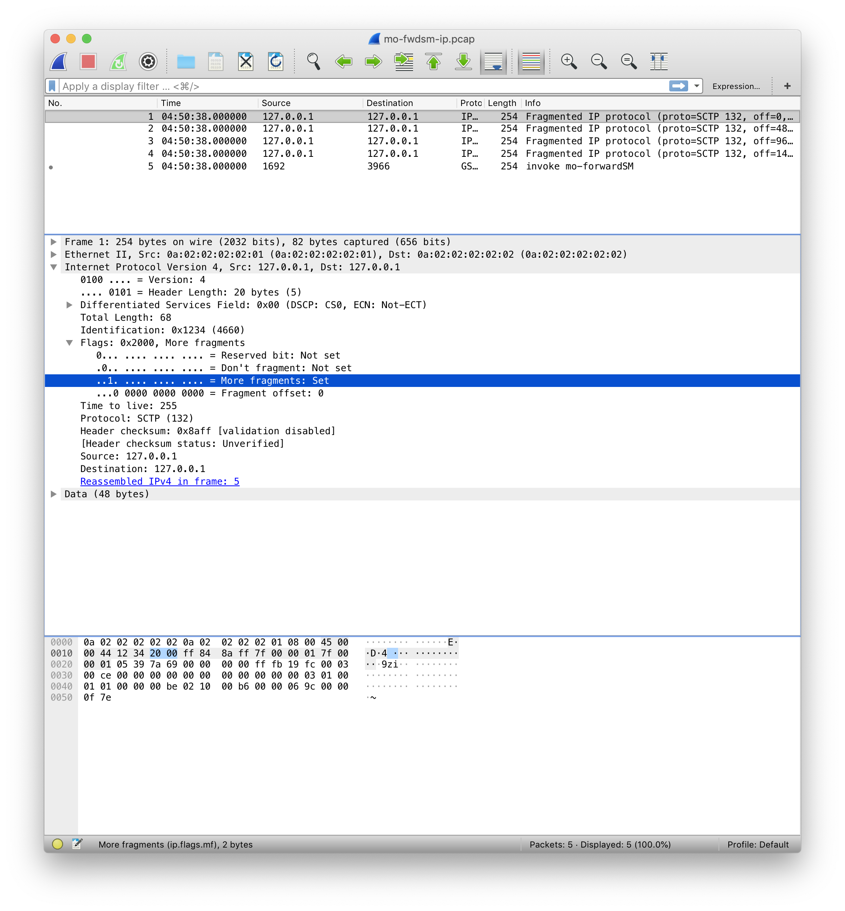
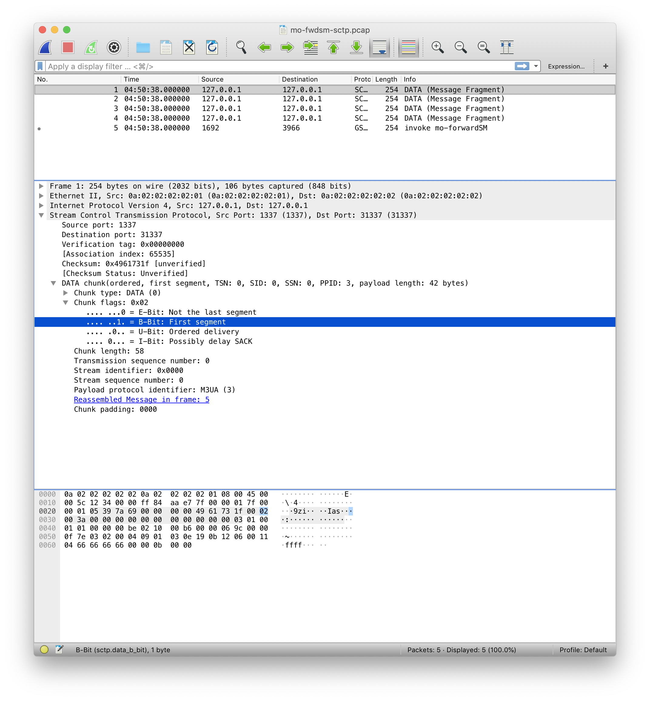
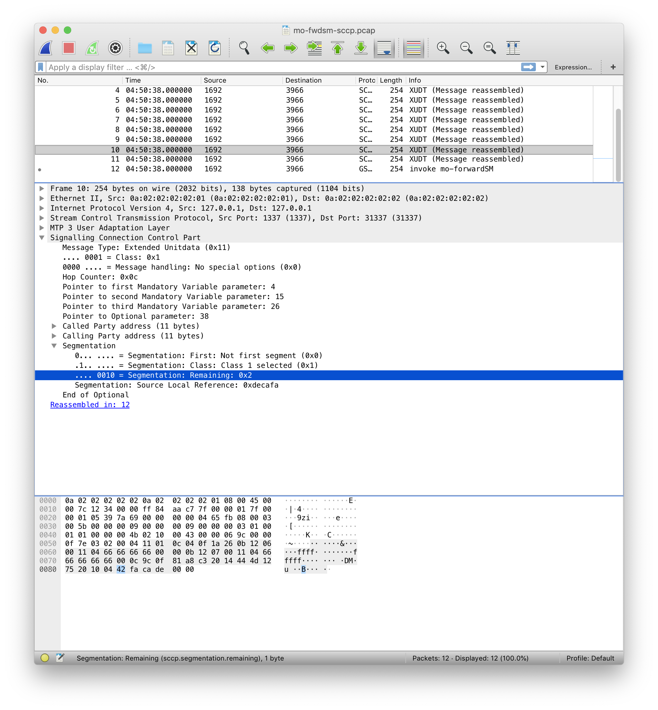

# ss7-fragz: Fragging SS7 for fun and profit

SS7 is nowadays transported over [SIGTRAN](https://en.wikipedia.org/wiki/SIGTRAN). The SIGTRAN stack relies on IP and SCTP. Above the adaptation layer - M2UA, M2PA, M3UA -, the rest of the legacy SS7 stack is kept intact: SCCP implements the transport layer of applicative messages, TCAP/MAP and TCAP/CAP for example.

Fragmentation and segmentation may happen at three levels, and three tools are provided to split a SIGTRAN packet in multiple pieces, assessing the reassembly capabilities of a given equipment.

The packet we will use to illustrate the way we cut is depicted below:

Three tools are provided to assess reassembly abilities at various levels - IPv4, SCTP and SCCP:

* [generate-ip-fragments.py](generate-ip-fragments.py);
* [generate-sctp-segments.py](generate-sctp-segments.py);
* [generate-sccp-xudts.py](generate-sccp-xudts.py);

## IPv4 fragmentation

Scapy provides `fragment` function that yields IP fragments. Keyword `fragsize` controls the size of the fragments. Two fields of the IPv4 header are of interest here:

* `More fragments` bit indicates whether this fragment is the last or not
* `Fragment offset` is 13 bits long and indicates the offset of this fragment in the overlong packet

**Note that the initial payload `invoke mo-forwardSM` is correctly decoded, as a compliant equipment would do.**

## SCTP segmentation

Scapy also provides us with SCTP mangling capabilities. `SCTPChunkData` allows us to play with the fields involved in SCTP segmentation:

* `E-bit` indicates if this segment is the last one
* `B-bit` indicates if this segment is the first one of a sequence
* `Transmission sequence number` allows to reorder segments prior to reassembly

**Note that the initial payload `invoke mo-forwardSM` is correctly decoded, as a compliant equipment would do.**

## SCCP segmentation

Now Scapy does not help us: generally speaking SS7 protocols support in Scapy is poor. A minimal embryonic implementation of M3UA/SCCP allows us to produce XUDT segments. The fiels involved are contained in the Segmentation element of information:

* `First` bit indicates if this segment is the first
* `Remaining` is 4 bits long and indicates the number of remaining segments. Thus a zero indicates the last segment, and segments may be ordered with respect to the remaining value

**Note that the initial payload `invoke mo-forwardSM` is correctly decoded, as a compliant equipment would do.**

# references

For the curious reader, a non-exhaustive list of references:

* [SCTP](https://tools.ietf.org/rfc/rfc4960.txt)
* [M3UA](https://tools.ietf.org/rfc/rfc4666.txt)
* [SCCP Q.713](https://www.itu.int/rec/T-REC-Q.713-200103-I/en)
